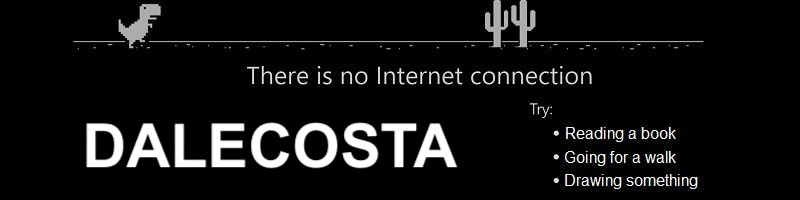

  

 

  
  

---

### About me

Hello world!!! I'm Dalecosta, a seasoned Software and DevOps Engineer. From immersive hackathons to spearheading digital transformations, my experience in cloud services, DevOps practices and backend development drives innovation and excellence 🚀

If you're curious about who I am and what I do for living, please look at my [website](https://dalecosta.com) or for more details see my [about me](https://dalecosta.com/blog/about-me) section!

If you need to contact me, you can do so at `dalecostadev@protonmail.com`. If you prefer book a call, you can do it on my [calendly](https://calendly.com/dalecostadev).

----- 

<b>Navigate through the languages, tools, os, frameworks and libraries powering my development journey</b>

  

